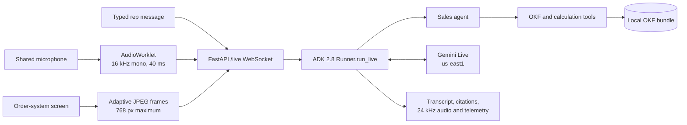

# Project overview

## Purpose

The Real-Time Sales Assistant is a local demonstration of an AI copilot for an
inside-sales representative working in an order system during a customer call.

It listens to the shared call microphone, observes periodic screenshots of the
rep's order-system window, and returns short, grounded guidance. Its principal
jobs are to:

1. answer SKU, discount, refund, proration, and policy questions;
2. guide order entry and everyday navigation, and explain documented errors; and
3. compute the figures a rep needs mid-call with deterministic tools.

The assistant advises only. It does not click in the order system, connect to
production systems, read CRM records, or act on the customer's account.

## Prototype audience and operating model

The primary user is the sales representative, not the customer. The customer
may be audible to the model, but the assistant's guidance is private to the rep:

- text is the default interface;
- generated voice is discarded until the rep enables Voice output;
- the rep explicitly addresses the assistant or types a request;
- the rep can switch the microphone off mid-session and continue by typing; and
- the customer is never treated as the assistant's user.

The demo uses one shared microphone. Gemini may perceive different voices, but
the Live API does not provide dependable speaker diarization, so incoming
speech is labelled **Call audio** rather than Rep or Customer.

## Architecture

The browser and server communicate over a localhost WebSocket. Audio and screen
frames are serialized to ADK `LiveRequestQueue` messages. ADK manages the
streaming connection to Gemini Live and executes local function tools.

## Browser design

The client is modular vanilla JavaScript with no build step.

- `audio-worklet.js` resamples the selected microphone and emits exact 40 ms,
  signed 16-bit PCM chunks.
- `audio-capture.js` opens and fully releases the microphone, so the rep can
  switch it off and on during a session.
- `audio-playback.js` decodes Gemini's URL-safe Base64 24 kHz PCM and schedules
  gapless playback. Muting discards queued audio instead of pausing it.
- `screen-capture.js` samples once per second but sends only changed frames, a
  heartbeat, or an explicitly requested frame.
- `transcript.js` keeps typed rep messages, Call audio transcription, agent
  transcription, tool activity, and local concept citations distinct.
- `settings.js` persists demo controls, including **Microphone on start**, to
  `localStorage`.
- `session.js` owns HTTP session creation, the WebSocket, and basic client
  reconnection.

Switching the microphone off stops capture, so the browser's microphone
indicator goes out. It also sends an `audio_end` control message, which the
server passes to Gemini as the end of the audio stream so no half-heard phrase
is left waiting. Any open Call audio line is closed. If microphone permission
is refused, the session continues in typed-only mode.

Screen frames are resized to a maximum of 768×768 and encoded as JPEG at 0.72
quality. A 32×32 greyscale comparison prevents a mostly static screen
from being sent continuously.

## Server and Live session design

The FastAPI server:

- creates an in-memory ADK session through `POST /session`;
- exposes the bidirectional `/live` WebSocket;
- validates text, audio, image, and control messages (`close`, and
  `audio_end` for the microphone switch);
- runs browser input, model output, and budget monitoring concurrently;
- serves the static client and local citation documents; and
- does not persist live audio, video, or transcripts.

The Live configuration uses:

- audio-only model output with input and output transcription;
- `en-CA` transcription hints;
- explicit end-of-speech sensitivity;
- proactive audio;
- transparent session resumption;
- context-window compression; and
- activity-only turn coverage.

Auto-reload is off unless `SERVER_RELOAD=true`, because a reload ends the live
session.

The UI displays elapsed time, model tokens, estimated public-list-price cost,
and reconnect count. The cost value is an estimate derived from modality token
metadata, not a billing-system total.

## Grounding design

All domain guidance must come from the local `knowledge/` bundle. Google Search,
vector databases, and hosted retrieval services are deliberately not used.

The tools are:

- `okf_index` to navigate directory indexes;
- `okf_search` for deterministic BM25-style keyword search with exact internal
  code boosting; question words such as "how" and "where" are ignored, and
  hyphenated terms also match their parts;
- `okf_read` to read the selected concept and expose its concept ID;
- `compute_installment_refund` for the monthly installment refund formula;
- `compute_proration` for daily proration of upgrades, add-ons, migrations,
  migration credits, downgrades, and cancellation refunds, with a paste-ready
  notes line;
- `build_discount_note` for validated, paste-ready discount notes (the codes
  and rules are placeholders to replace); and
- `calculate` for any other exact arithmetic or date difference.

When a tool raises an error, an ADK `on_tool_error_callback` returns the message
to the model, which can correct its input or tell the rep. Without it, one bad
tool call (for example, a mistyped concept ID) would end the live session.

Deprecated concepts are excluded from normal search. When explicitly read, they
carry a `superseded_by` pointer to current guidance, which stops an old price
list from overriding the current one.

## Knowledge scope

The shipped bundle is a small fictional placeholder (vendor "Acme") covering
SKUs, order-entry walkthroughs, discount codes, proration, installment refunds,
common errors, and system navigation. See
[AUTHORING_KNOWLEDGE.md](AUTHORING_KNOWLEDGE.md) for replacing it. No concept
may be represented as human-verified until a human review has occurred.

## Proration

`compute_proration` implements:

> prorated amount = (new annual price − current annual price − any dollar
> discount) ÷ day basis × days remaining, where days remaining = expiry date −
> effective date

Amounts are before tax and rounded once, to the cent. A negative result is a
prorated refund or credit. The day basis is 365 by default; set
`PRORATION_DAY_BASIS=364` to change it.

## Privacy and deployment boundaries

This is a localhost, single-user prototype:

- no authentication or multi-user deployment;
- no connection to production systems;
- no real customer data;
- no live captures saved unless `SAVE_LIVE_BLOB=true` is deliberately enabled;
- English only; and
- audio and screen data processed in the configured Google Cloud region.

These boundaries would need a separate privacy, residency, security, and
production-readiness review before real-customer use.

## Known limitations

- a browser reconnect starts a new server-side budget, so elapsed time, tokens,
  and cost restart from zero; and
- the reconnect counter counts browser reconnects, not the Live API
  resumptions that ADK performs internally.

## Repository guide

- `README.md` — quick setup and status
- `docs/START_DEMO.md` — setup, startup, and rehearsal
- `docs/AUTHORING_KNOWLEDGE.md` — replacing the placeholder knowledge
- `docs/PRD.md` — requirements template
- `app/server.py` — FastAPI application and Live WebSocket bridge
- `app/live_config.py` — ADK Live configuration
- `app/client/` — browser interface and media pipeline
- `app/sales_agent/` — agent instruction, knowledge tools, calculation tools
- `knowledge/` — OKF bundle (placeholder)
- `grounding/` — your source documents (empty)
- `tools/okf_build/` — bundle validation tooling
- `tests/` — Python and browser regression tests
